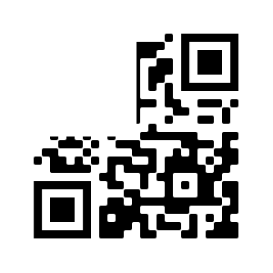
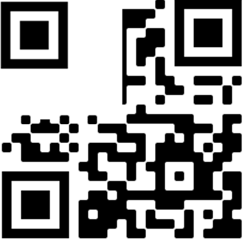

# Simulated space combat [90 pts]

**Category:** forensics
**Solves:** 42

## Description
>One of our fellow operators has sent a secret transmission. We managed to get 70% of the message, I wonder if you can figure out the rest.\r\n\r\nAuthor: Hades95200

**Hint**
* -

## Solution
We are provided with a partial QR code:

We first add the missing eye using image manipulation tools:

With the QR code, we can upload it to [QRazyBox](https://merricx.github.io/qrazybox/) to get the partial flag: `CYBERLEAGUE{qR_N0t_R4g3Qu`

By learning abit more about how QR code is decoded, we learn that tmost of the unknown bits is part of recovery bits which is not important to us, so we only need to recover only a small part of the QR code. (More specifically 3 characters)

We can then guess the flag (the last word is prob ragequit) which is 2 characters.

### Flag
`CYBERLEAGUE{qR_N0t_R4g3Qu1t}`