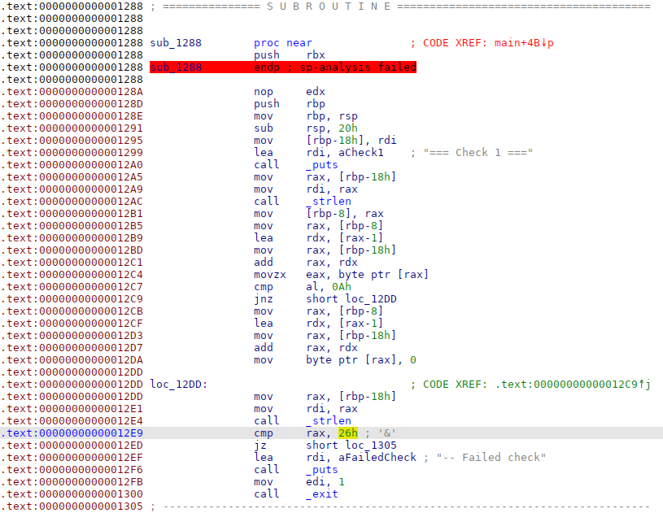

# easycrackme [482 pts]

**Category:** Reverse Engineering
**Solves:** 10

## Description
>I think this is easy. Hope you do too. Find the correct key that the program expects.

**Hint**
* -

## Solution

For this chall, we are given with only one binary file and no source code. This means that we have to use a decompiler to decompile the file into 'readable' code. Ghidra or IDA will work fine.

The `easycrackme` binary requests a key from the user and subjects it to 6 different checks. Our job is then to decompile the binary and understand what these functions checks for

Using IDA, I decompiled the binary and obtained a human-readable decompiled code. 

### Check 1
This decompiled function is corrupted (in terms of memory pointer) and IDA cannot resolve the memory corruption. As a result the decompiled function does not hold anything useful. So if the memory mapping is corrupted, we just have to manually find the indicated memory address in the disassembly (read disassembly code)



From the disassembly, we can see that `strlen` is called and the result is compared with `26h`, this decides whether the check 1 fails or passes.

Hence, the 1st check simply checks if length of key is 38

### Check 2
From the decompiled function, the code is quite straightforward and simply checks if the key starts with `greyhats{`

### Check 3
Of course, this function checks that the key ends with `}`

### Check 4
This function converts string '0'-'9' to 0-9 and 'a-f' to 10-15. It thens joins every adjacent 2 hex together to form a character.

Sounds familiar?

This function does a hex decode of your partial key and checks it with 'olympics'

So the flag portion from check 4 is `6f6c796d70696373` (hex encode of 'olympics')

## Check 5
This functions essentially checks that the 1st char ^ 32 = 'i' and 2nd char ^ 33 = 'n'

Reverse engineering it gives:
```js
(32 ^ 'i') + (33 ^ 'n') => 'I0'
```

## Check 6
This check is very complicated with alot of variables and bitwise operaiton. 

So this function does some operations on the last part of the key and checks that it is the string 'tokyo'

As I begin reverse-engineering it, the first thing that I noticed was that the function checks that the key ends with '='. This might hint at base64 encoding and I decided to gave it a try.

VOILA! This check is indeed a base64 decoding of the key.

This gives me `dG9reW8=` (base64 encoding of 'tokyo') as my last reverse-engineering output from the checks.

Putting them all together, I got the flag!

### Flag
`greyhats{6f6c796d70696373_IO_dG9reW8=}`